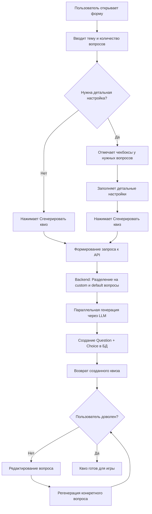

# План развития системы генерации квизов

## Цель
Создать гибкий и интуитивный интерфейс генерации квизов с единым экраном настройки, где пользователь может быстро создать квиз с настройками по умолчанию или детально настроить любой вопрос без переключения режимов.

---

## Текущее состояние

### Что работает сейчас
- ✅ Автоматическая генерация вопросов через LLM (OpenAI API)
- ✅ Автоматическая кривая сложности
- ✅ Фиксированное время на вопрос (настраивается на уровне квиза)
- ✅ Только текстовые вопросы с 4 вариантами ответа
- ✅ Автоматический выбор изображений по категориям

### Ограничения
- ❌ Пользователь не может управлять сложностью вопросов
- ❌ Нельзя задать индивидуальное время для каждого вопроса
- ❌ Нет возможности уточнить тему для конкретного вопроса
- ❌ Нет выбора типа вопроса (только текст + 4 варианта)
- ❌ Нельзя редактировать настройки перед генерацией

---

## Новая концепция UX

### Принципы дизайна
1. **Единый экран** - все настройки на одной странице
2. **Прогрессивное раскрытие** - базовые настройки видны сразу, детальные - по запросу
3. **Визуальная обратная связь** - индикаторы изменённых настроек
4. **Быстрый старт** - можно сгенерировать квиз в 2 клика
5. **Гибкость** - можно настроить любой вопрос детально

### Workflow пользователя

#### Сценарий 1: Быстрая генерация (2 клика)
```
1. Ввести тему: "История России"
2. Нажать "Сгенерировать квиз"
→ Готово! Квиз создан с 10 вопросами и настройками по умолчанию
```

#### Сценарий 2: Настройка отдельных вопросов
```
1. Ввести тему: "История России"
2. Изменить количество вопросов: 15
3. Отметить чекбокс у вопроса 3
4. Настроить вопрос 3: сложность hard, время 30 сек, уточнение "Вторая мировая"
5. Отметить чекбокс у вопроса 7
6. Настроить вопрос 7: сложность very_hard, время 45 сек
7. Нажать "Сгенерировать квиз"
→ Готово! 13 вопросов с базовыми настройками + 2 с индивидуальными
```

#### Сценарий 3: Изменение базовых настроек
```
1. Ввести тему: "Музыка 80-х"
2. Изменить базовую сложность: easy
3. Изменить базовое время: 15 сек
4. Нажать "Сгенерировать квиз"
→ Готово! Все вопросы лёгкие с временем 15 сек
```

---

## UI/UX дизайн

### Единый экран генерации квиза

```
┌─────────────────────────────────────────────────────────────────┐
│ Создание квиза                                    [Сбросить всё]│
├─────────────────────────────────────────────────────────────────┤
│                                                                 │
│ ┌─────────────────────────────────────────────────────────┐    │
│ │ Основные параметры                                      │    │
│ │                                                         │    │
│ │ Тема квиза *                                            │    │
│ │ [История России                                    ]    │    │
│ │                                                         │    │
│ │ Количество вопросов                                     │    │
│ │ [10] ◄─────────────────────────────────────────► [50]   │    │
│ │                                                         │    │
│ └─────────────────────────────────────────────────────────┘    │
│                                                                 │
│ ┌─────────────────────────────────────────────────────────┐    │
│ │ Настройки по умолчанию                                  │    │
│ │ (применяются ко всем вопросам без индивидуальных        │    │
│ │  настроек)                                              │    │
│ │                                                         │    │
│ │ Сложность: [medium ▼]  Время: [20] сек  Тип: [text ▼]  │    │
│ └─────────────────────────────────────────────────────────┘    │
│                                                                 │
│ ┌─────────────────────────────────────────────────────────┐    │
│ │ Вопросы                                                 │    │
│ │                                                         │    │
│ │ ┌─────────────────────────────────────────────────┐    │    │
│ │ │ Вопрос 1                          [ ] Настроить │    │    │
│ │ └─────────────────────────────────────────────────┘    │    │
│ │                                                         │    │
│ │ ┌─────────────────────────────────────────────────┐    │    │
│ │ │ Вопрос 2                          [ ] Настроить │    │    │
│ │ └─────────────────────────────────────────────────┘    │    │
│ │                                                         │    │
│ │ ┌─────────────────────────────────────────────────┐    │    │
│ │ │ Вопрос 3                    🔧    [✓] Настроить │    │    │
│ │ ├─────────────────────────────────────────────────┤    │    │
│ │ │ Сложность: [hard ▼]                             │    │    │
│ │ │ Время: [30] сек                                 │    │    │
│ │ │ Тип: [image ▼]                                  │    │    │
│ │ │ Уточнение темы:                                 │    │    │
│ │ │ [Вторая мировая война                      ]    │    │    │
│ │ │                          [Сбросить к умолчанию] │    │    │
│ │ └─────────────────────────────────────────────────┘    │    │
│ │                                                         │    │
│ │ ┌─────────────────────────────────────────────────┐    │    │
│ │ │ Вопрос 4                          [ ] Настроить │    │    │
│ │ └─────────────────────────────────────────────────┘    │    │
│ │                                                         │    │
│ │ ┌─────────────────────────────────────────────────┐    │    │
│ │ │ Вопрос 5                          [ ] Настроить │    │    │
│ │ └─────────────────────────────────────────────────┘    │    │
│ │                                                         │    │
│ │ ┌─────────────────────────────────────────────────┐    │    │
│ │ │ Вопрос 6                          [ ] Настроить │    │    │
│ │ └─────────────────────────────────────────────────┘    │    │
│ │                                                         │    │
│ │ ┌─────────────────────────────────────────────────┐    │    │
│ │ │ Вопрос 7                    🔧    [✓] Настроить │    │    │
│ │ ├─────────────────────────────────────────────────┤    │    │
│ │ │ Сложность: [very_hard ▼]                        │    │    │
│ │ │ Время: [45] сек                                 │    │    │
│ │ │ Тип: [text ▼]                                   │    │    │
│ │ │ Уточнение темы:                                 │    │    │
│ │ │ [Битва за Москву                           ]    │    │    │
│ │ │                          [Сбросить к умолчанию] │    │    │
│ │ └─────────────────────────────────────────────────┘    │    │
│ │                                                         │    │
│ │ ┌─────────────────────────────────────────────────┐    │    │
│ │ │ Вопрос 8                          [ ] Настроить │    │    │
│ │ └─────────────────────────────────────────────────┘    │    │
│ │                                                         │    │
│ │ ... (ещё 2 вопроса)                                     │    │
│ │                                                         │    │
│ └─────────────────────────────────────────────────────────┘    │
│                                                                 │
│                                    [Сгенерировать квиз]         │
└─────────────────────────────────────────────────────────────────┘
```

### Визуальные индикаторы

#### Иконка 🔧 (гаечный ключ)
- Показывается рядом с номером вопроса
- Означает, что вопрос имеет индивидуальные настройки
- Помогает быстро найти настроенные вопросы

#### Чекбокс "Настроить"
- **Не отмечен** → вопрос использует настройки по умолчанию
- **Отмечен** → раскрывается панель с детальными настройками

#### Кнопка "Сбросить к умолчанию"
- Появляется только в раскрытой панели настроек
- Сбрасывает настройки конкретного вопроса к базовым
- Снимает чекбокс и скрывает панель

#### Кнопка "Сбросить всё" (в шапке)
- Сбрасывает ВСЕ индивидуальные настройки
- Возвращает все вопросы к настройкам по умолчанию
- Требует подтверждения

### Поведение при изменении количества вопросов

```
Было: 10 вопросов (вопрос 3 и 7 настроены)
Стало: 15 вопросов

Результат:
- Вопросы 1-10: сохраняют свои настройки
- Вопросы 11-15: создаются с настройками по умолчанию
```

```
Было: 10 вопросов (вопрос 3 и 7 настроены)
Стало: 5 вопросов

Результат:
- Вопросы 1-5: сохраняют свои настройки
- Вопросы 6-10: удаляются (с предупреждением!)
```

---

## Изменения в моделях данных

### Расширение модели Question

```python
class Question(models.Model):
    # Существующие поля
    quiz = models.ForeignKey(Quiz, ...)
    order = models.IntegerField(...)
    text = models.TextField(...)
    difficulty = models.CharField(...)
    time_limit = models.IntegerField(...)  # уже есть!
    
    # НОВЫЕ ПОЛЯ
    question_type = models.CharField(
        max_length=20,
        choices=[
            ('text', 'Текстовый'),
            ('image', 'С изображением'),
            ('audio', 'Аудио вопрос'),
            ('video', 'Видео вопрос'),
        ],
        default='text',
        verbose_name="Тип вопроса"
    )
    
    topic_refinement = models.CharField(
        max_length=200,
        blank=True,
        verbose_name="Уточнение темы",
        help_text="Конкретизация темы для этого вопроса"
    )
    
    has_custom_settings = models.BooleanField(
        default=False,
        verbose_name="Имеет индивидуальные настройки",
        help_text="True если вопрос настроен вручную"
    )
```

### Новая модель QuestionConfig (временная, для UI)

```python
class QuestionConfig(models.Model):
    """
    Конфигурация вопроса перед генерацией
    Используется только в UI, не сохраняется после генерации
    """
    quiz_draft = models.ForeignKey('QuizDraft', related_name='question_configs', ...)
    order = models.IntegerField(...)
    
    # Настройки
    use_custom_settings = models.BooleanField(default=False)
    difficulty = models.CharField(max_length=20, blank=True)
    time_limit = models.IntegerField(null=True, blank=True)
    question_type = models.CharField(max_length=20, blank=True)
    topic_refinement = models.CharField(max_length=200, blank=True)
    
    class Meta:
        ordering = ['order']
```

### Новая модель QuizDraft (черновик квиза)

```python
class QuizDraft(models.Model):
    """
    Черновик квиза для сохранения настроек перед генерацией
    Позволяет пользователю вернуться и изменить настройки
    """
    topic = models.CharField(max_length=200)
    num_questions = models.IntegerField(default=10)
    
    # Базовые настройки
    base_difficulty = models.CharField(max_length=20, default='medium')
    base_time_limit = models.IntegerField(default=20)
    base_question_type = models.CharField(max_length=20, default='text')
    
    # Метаданные
    created_at = models.DateTimeField(auto_now_add=True)
    updated_at = models.DateTimeField(auto_now=True)
    is_generated = models.BooleanField(default=False)
    generated_quiz = models.ForeignKey(
        Quiz,
        null=True,
        blank=True,
        on_delete=models.SET_NULL
    )
```

---

## Изменения в API

### 1. Создание черновика квиза

```
POST /api/quiz-drafts/

Body:
{
  "topic": "История России",
  "num_questions": 10,
  "base_difficulty": "medium",
  "base_time_limit": 20,
  "base_question_type": "text"
}

Response:
{
  "id": 1,
  "topic": "История России",
  "num_questions": 10,
  "base_difficulty": "medium",
  "base_time_limit": 20,
  "base_question_type": "text",
  "question_configs": [
    {
      "order": 1,
      "use_custom_settings": false,
      "difficulty": "",
      "time_limit": null,
      "question_type": "",
      "topic_refinement": ""
    },
    // ... ещё 9 вопросов
  ]
}
```

### 2. Обновление конфигурации вопроса

```
PATCH /api/quiz-drafts/{id}/questions/{order}/

Body:
{
  "use_custom_settings": true,
  "difficulty": "hard",
  "time_limit": 30,
  "question_type": "image",
  "topic_refinement": "Вторая мировая война"
}

Response:
{
  "order": 3,
  "use_custom_settings": true,
  "difficulty": "hard",
  "time_limit": 30,
  "question_type": "image",
  "topic_refinement": "Вторая мировая война"
}
```

### 3. Сброс настроек вопроса

```
POST /api/quiz-drafts/{id}/questions/{order}/reset/

Response:
{
  "order": 3,
  "use_custom_settings": false,
  "difficulty": "",
  "time_limit": null,
  "question_type": "",
  "topic_refinement": ""
}
```

### 4. Сброс всех настроек

```
POST /api/quiz-drafts/{id}/reset-all/

Response:
{
  "message": "Все индивидуальные настройки сброшены",
  "reset_count": 2
}
```

### 5. Генерация квиза из черновика

```
POST /api/quiz-drafts/{id}/generate/

Response:
{
  "quiz_id": 42,
  "title": "Квиз: История России",
  "question_count": 10,
  "questions": [...]
}
```

### 6. Упрощённый endpoint (без черновика)

```
POST /api/quizzes/generate/

Body:
{
  "topic": "История России",
  "num_questions": 10,
  
  // Базовые настройки
  "base_settings": {
    "difficulty": "medium",
    "time_limit": 20,
    "question_type": "text"
  },
  
  // Индивидуальные настройки для конкретных вопросов
  "custom_questions": [
    {
      "order": 3,
      "difficulty": "hard",
      "time_limit": 30,
      "question_type": "image",
      "topic_refinement": "Вторая мировая война"
    },
    {
      "order": 7,
      "difficulty": "very_hard",
      "time_limit": 45,
      "question_type": "text",
      "topic_refinement": "Битва за Москву"
    }
  ]
}

Response:
{
  "quiz_id": 42,
  "title": "Квиз: История России",
  "question_count": 10,
  "custom_questions_count": 2,
  "questions": [...]
}
```

---

## Изменения в логике генерации

### Модификация generation.py

```python
def generate_quiz_from_config(
    topic: str,
    num_questions: int,
    base_settings: dict,
    custom_questions: list = None
):
    """
    Генерирует квиз с учётом базовых и индивидуальных настроек
    
    Args:
        topic: тема квиза
        num_questions: количество вопросов
        base_settings: базовые настройки (difficulty, time_limit, question_type)
        custom_questions: список индивидуальных настроек [{order, difficulty, ...}]
    
    Returns:
        Quiz: созданный квиз
    """
    # Создаём квиз
    quiz = Quiz.objects.create(
        title=f"Квиз: {topic}",
        topic=topic,
        time_per_question=base_settings.get('time_limit', 20)
    )
    
    # Создаём карту индивидуальных настроек
    custom_map = {}
    if custom_questions:
        custom_map = {q['order']: q for q in custom_questions}
    
    # Генерируем вопросы
    questions_to_generate = []
    
    for order in range(1, num_questions + 1):
        if order in custom_map:
            # Индивидуальные настройки
            config = custom_map[order]
            questions_to_generate.append({
                'order': order,
                'difficulty': config.get('difficulty', base_settings['difficulty']),
                'time_limit': config.get('time_limit', base_settings['time_limit']),
                'question_type': config.get('question_type', base_settings['question_type']),
                'topic_refinement': config.get('topic_refinement', ''),
                'has_custom_settings': True
            })
        else:
            # Базовые настройки + автоматическая кривая сложности
            auto_difficulty = get_auto_difficulty(order, num_questions)
            questions_to_generate.append({
                'order': order,
                'difficulty': auto_difficulty or base_settings['difficulty'],
                'time_limit': base_settings['time_limit'],
                'question_type': base_settings['question_type'],
                'topic_refinement': '',
                'has_custom_settings': False
            })
    
    # Генерируем вопросы параллельно
    generated_questions = generate_questions_parallel(
        quiz=quiz,
        topic=topic,
        questions_config=questions_to_generate
    )
    
    return quiz


def get_auto_difficulty(order: int, total: int) -> str:
    """
    Автоматическая кривая сложности для вопросов без индивидуальных настроек
    
    Args:
        order: номер вопроса (1-based)
        total: общее количество вопросов
    
    Returns:
        str: сложность (easy, medium, hard, very_hard, fun)
    """
    progress = (order - 1) / total
    
    if order == 1:
        return 'easy'  # Разминка
    elif progress < 0.3:
        return 'medium'
    elif progress < 0.7:
        return 'hard'
    elif order == total:
        return 'fun'  # Финальный вопрос - разрядка
    else:
        return 'very_hard'


async def generate_questions_parallel(
    quiz: Quiz,
    topic: str,
    questions_config: list
):
    """
    Параллельная генерация вопросов для ускорения
    
    Args:
        quiz: экземпляр Quiz
        topic: тема квиза
        questions_config: список конфигураций вопросов
    
    Returns:
        list: созданные вопросы
    """
    import asyncio
    
    # Группируем вопросы: с индивидуальными настройками и без
    custom_questions = [q for q in questions_config if q['has_custom_settings']]
    default_questions = [q for q in questions_config if not q['has_custom_settings']]
    
    tasks = []
    
    # Вопросы с индивидуальными настройками генерируем по одному
    for config in custom_questions:
        task = generate_single_question_async(quiz, topic, config)
        tasks.append(task)
    
    # Вопросы с базовыми настройками генерируем пакетом (быстрее)
    if default_questions:
        task = generate_batch_questions_async(quiz, topic, default_questions)
        tasks.append(task)
    
    # Запускаем параллельно
    results = await asyncio.gather(*tasks)
    
    return results
```

### Модификация prompts.py

```python
def build_prompt_for_question(
    topic: str,
    difficulty: str,
    question_type: str = 'text',
    topic_refinement: str = ''
):
    """
    Генерирует промпт для ОДНОГО вопроса с детальными настройками
    
    Args:
        topic: основная тема квиза
        difficulty: сложность вопроса
        question_type: тип вопроса (text, image, audio, video)
        topic_refinement: уточнение темы для этого вопроса
    
    Returns:
        str: промпт для LLM
    """
    # Формируем финальную тему
    final_topic = topic
    if topic_refinement:
        final_topic = f"{topic} (конкретно: {topic_refinement})"
    
    # Инструкции по типу вопроса
    type_instructions = get_type_instructions(question_type)
    
    prompt = f"""Создай ОДИН вопрос для викторины.

ТЕМА: {final_topic}
СЛОЖНОСТЬ: {DIFFICULTY_DESCRIPTIONS[difficulty]}
ТИП ВОПРОСА: {question_type}

{type_instructions}

ФОРМАТ ВЫВОДА — строго JSON:
{{
  "text": "Текст вопроса (до 200 символов)",
  "choices": ["Вариант 1", "Вариант 2", "Вариант 3", "Вариант 4"],
  "correct_index": 0,
  "difficulty": "{difficulty}",
  "explanation": "Объяснение (до 300 символов)",
  "image_url": ""
}}

ПРАВИЛА:
1. Ровно 4 варианта ответа
2. Все неправильные ответы должны быть ПРАВДОПОДОБНЫМИ
3. Варианты должны быть УНИКАЛЬНЫМИ
4. correct_index: число от 0 до 3

Верни ТОЛЬКО валидный JSON, без markdown.
"""
    return prompt


def get_type_instructions(question_type: str) -> str:
    """Возвращает инструкции для конкретного типа вопроса"""
    
    instructions = {
        'text': """
Создай текстовый вопрос с 4 вариантами ответа.
Все варианты должны быть правдоподобными.
""",
        'image': """
Создай вопрос, который требует визуального восприятия.
Например: "Кто изображён на этой фотографии?"
Укажи подходящий image_url из доступных.
""",
        'audio': """
Создай вопрос про музыку или звук.
Например: "Какая группа исполняет эту песню?"
""",
        'video': """
Создай вопрос про видео или фильм.
Например: "Из какого фильма этот кадр?"
"""
    }
    
    return instructions.get(question_type, instructions['text'])
```

---

## Frontend компоненты

### 1. QuizGenerationForm (главный компонент)

```jsx
// frontend/src/components/Admin/QuizGenerationForm.jsx

import { useState, useEffect } from 'react';

export default function QuizGenerationForm() {
  const [topic, setTopic] = useState('');
  const [numQuestions, setNumQuestions] = useState(10);
  
  // Базовые настройки
  const [baseSettings, setBaseSettings] = useState({
    difficulty: 'medium',
    time_limit: 20,
    question_type: 'text'
  });
  
  // Конфигурации вопросов
  const [questionConfigs, setQuestionConfigs] = useState([]);
  
  // Инициализация вопросов при изменении количества
  useEffect(() => {
    const newConfigs = Array.from({ length: numQuestions }, (_, i) => ({
      order: i + 1,
      use_custom_settings: false,
      difficulty: '',
      time_limit: null,
      question_type: '',
      topic_refinement: ''
    }));
    
    // Сохраняем существующие настройки
    setQuestionConfigs(prev => {
      return newConfigs.map((config, i) => {
        if (prev[i] && prev[i].use_custom_settings) {
          return prev[i];
        }
        return config;
      });
    });
  }, [numQuestions]);
  
  // Переключение индивидуальных настроек
  const toggleCustomSettings = (order) => {
    setQuestionConfigs(prev => prev.map(q => 
      q.order === order 
        ? { ...q, use_custom_settings: !q.use_custom_settings }
        : q
    ));
  };
  
  // Обновление настроек вопроса
  const updateQuestionConfig = (order, field, value) => {
    setQuestionConfigs(prev => prev.map(q =>
      q.order === order
        ? { ...q, [field]: value }
        : q
    ));
  };
  
  // Сброс настроек вопроса
  const resetQuestionConfig = (order) => {
    setQuestionConfigs(prev => prev.map(q =>
      q.order === order
        ? {
            order,
            use_custom_settings: false,
            difficulty: '',
            time_limit: null,
            question_type: '',
            topic_refinement: ''
          }
        : q
    ));
  };
  
  // Сброс всех настроек
  const resetAllConfigs = () => {
    if (confirm('Сбросить все индивидуальные настройки?')) {
      setQuestionConfigs(prev => prev.map(q => ({
        order: q.order,
        use_custom_settings: false,
        difficulty: '',
        time_limit: null,
        question_type: '',
        topic_refinement: ''
      })));
    }
  };
  
  // Генерация квиза
  const handleGenerate = async () => {
    const customQuestions = questionConfigs
      .filter(q => q.use_custom_settings)
      .map(q => ({
        order: q.order,
        difficulty: q.difficulty || baseSettings.difficulty,
        time_limit: q.time_limit || baseSettings.time_limit,
        question_type: q.question_type || baseSettings.question_type,
        topic_refinement: q.topic_refinement
      }));
    
    const payload = {
      topic,
      num_questions: numQuestions,
      base_settings: baseSettings,
      custom_questions: customQuestions
    };
    
    // API запрос
    const response = await fetch('/api/quizzes/generate/', {
      method: 'POST',
      headers: { 'Content-Type': 'application/json' },
      body: JSON.stringify(payload)
    });
    
    const data = await response.json();
    console.log('Квиз создан:', data);
  };
  
  return (
    <div className="quiz-generation-form">
      {/* Шапка */}
      <div className="header">
        <h2>Создание квиза</h2>
        <button onClick={resetAllConfigs}>Сбросить всё</button>
      </div>
      
      {/* Основные параметры */}
      <div className="main-params">
        <h3>Основные параметры</h3>
        <input
          type="text"
          placeholder="Тема квиза"
          value={topic}
          onChange={(e) => setTopic(e.target.value)}
        />
        <input
          type="range"
          min="5"
          max="50"
          value={numQuestions}
          onChange={(e) => setNumQuestions(parseInt(e.target.value))}
        />
        <span>{numQuestions} вопросов</span>
      </div>
      
      {/* Базовые настройки */}
      <div className="base-settings">
        <h3>Настройки по умолчанию</h3>
        <select
          value={baseSettings.difficulty}
          onChange={(e) => setBaseSettings({...baseSettings, difficulty: e.target.value})}
        >
          <option value="easy">Лёгкий</option>
          <option value="medium">Средний</option>
          <option value="hard">Сложный</option>
          <option value="very_hard">Очень сложный</option>
        </select>
        
        <input
          type="number"
          value={baseSettings.time_limit}
          onChange={(e) => setBaseSettings({...baseSettings, time_limit: parseInt(e.target.value)})}
        />
        
        <select
          value={baseSettings.question_type}
          onChange={(e) => setBaseSettings({...baseSettings, question_type: e.target.value})}
        >
          <option value="text">Текстовый</option>
          <option value="image">С изображением</option>
          <option value="audio">Аудио</option>
          <option value="video">Видео</option>
        </select>
      </div>
      
      {/* Список вопросов */}
      <div className="questions-list">
        <h3>Вопросы</h3>
        {questionConfigs.map(config => (
          <QuestionConfigItem
            key={config.order}
            config={config}
            baseSettings={baseSettings}
            onToggle={() => toggleCustomSettings(config.order)}
            onUpdate={(field, value) => updateQuestionConfig(config.order, field, value)}
            onReset={() => resetQuestionConfig(config.order)}
          />
        ))}
      </div>
      
      {/* Кнопка генерации */}
      <button onClick={handleGenerate} className="generate-btn">
        Сгенерировать квиз
      </button>
    </div>
  );
}
```

### 2. QuestionConfigItem (элемент списка вопросов)

```jsx
// frontend/src/components/Admin/QuestionConfigItem.jsx

export default function QuestionConfigItem({
  config,
  baseSettings,
  onToggle,
  onUpdate,
  onReset
}) {
  return (
    <div className="question-config-item">
      {/* Заголовок */}
      <div className="question-header">
        <span>
          Вопрос {config.order}
          {config.use_custom_settings && <span className="custom-icon">🔧</span>}
        </span>
        <label>
          <input
            type="checkbox"
            checked={config.use_custom_settings}
            onChange={onToggle}
          />
          Настроить
        </label>
      </div>
      
      {/* Панель настроек (раскрывается при включенном чекбоксе) */}
      {config.use_custom_settings && (
        <div className="question-settings">
          <div className="setting-row">
            <label>Сложность:</label>
            <select
              value={config.difficulty || baseSettings.difficulty}
              onChange={(e) => onUpdate('difficulty', e.target.value)}
            >
              <option value="easy">Лёгкий</option>
              <option value="medium">Средний</option>
              <option value="hard">Сложный</option>
              <option value="very_hard">Очень сложный</option>
              <option value="fun">Шуточный</option>
            </select>
          </div>
          
          <div className="setting-row">
            <label>Время:</label>
            <input
              type="number"
              value={config.time_limit || baseSettings.time_limit}
              onChange={(e) => onUpdate('time_limit', parseInt(e.target.value))}
            />
            <span>сек</span>
          </div>
          
          <div className="setting-row">
            <label>Тип:</label>
            <select
              value={config.question_type || baseSettings.question_type}
              onChange={(e) => onUpdate('question_type', e.target.value)}
            >
              <option value="text">Текстовый</option>
              <option value="image">С изображением</option>
              <option value="audio">Аудио</option>
              <option value="video">Видео</option>
            </select>
          </div>
          
          <div className="setting-row">
            <label>Уточнение темы:</label>
            <input
              type="text"
              placeholder="Например: Вторая мировая война"
              value={config.topic_refinement}
              onChange={(e) => onUpdate('topic_refinement', e.target.value)}
            />
          </div>
          
          <button onClick={onReset} className="reset-btn">
            Сбросить к умолчанию
          </button>
        </div>
      )}
    </div>
  );
}
```

---

## Диаграмма процесса



---

## План реализации

### Этап 1: Backend - Модели и миграции
- [ ] Добавить поля в модель [`Question`](backend/quiz_app/models.py:79) (question_type, topic_refinement, has_custom_settings)
- [ ] Создать модель QuizDraft
- [ ] Создать модель QuestionConfig
- [ ] Создать миграции
- [ ] Обновить сериализаторы

### Этап 2: Backend - API endpoints
- [ ] POST /api/quiz-drafts/ - создание черновика
- [ ] PATCH /api/quiz-drafts/{id}/questions/{order}/ - обновление конфигурации
- [ ] POST /api/quiz-drafts/{id}/questions/{order}/reset/ - сброс настроек вопроса
- [ ] POST /api/quiz-drafts/{id}/reset-all/ - сброс всех настроек
- [ ] POST /api/quiz-drafts/{id}/generate/ - генерация из черновика
- [ ] POST /api/quizzes/generate/ - упрощённый endpoint (модификация существующего)

### Этап 3: Backend - Логика генерации
- [ ] Модификация [`prompts.py`](backend/quiz_app/prompts.py:1) - функция build_prompt_for_question
- [ ] Модификация [`generation.py`](backend/quiz_app/generation.py:1) - функция generate_quiz_from_config
- [ ] Функция get_auto_difficulty для автоматической кривой
- [ ] Функция generate_questions_parallel для параллельной генерации
- [ ] Поддержка разных типов вопросов (text, image, audio, video)

### Этап 4: Frontend - Компоненты
- [ ] QuizGenerationForm - главная форма
- [ ] QuestionConfigItem - элемент списка вопросов
- [ ] Стили и анимации для раскрывающихся панелей
- [ ] Интеграция с существующим AdminPanel

### Этап 5: Frontend - Логика
- [ ] State management для конфигураций вопросов
- [ ] Обработка изменения количества вопросов
- [ ] Функции toggle/update/reset для настроек
- [ ] API интеграция

### Этап 6: Тестирование
- [ ] Тестирование всех сценариев использования
- [ ] Проверка работы с разным количеством вопросов
- [ ] Тестирование параллельной генерации
- [ ] Проверка UI/UX на разных разрешениях

### Этап 7: Оптимизация
- [ ] Оптимизация промптов для LLM
- [ ] Кеширование результатов
- [ ] Обработка ошибок и edge cases
- [ ] Добавление loading states

---

## Дополнительные возможности (будущее)

### Сохранение шаблонов
- Возможность сохранить конфигурацию как шаблон
- Библиотека готовых шаблонов
- Импорт/экспорт конфигураций

### Умные подсказки
- Анализ темы и предложение оптимальных настроек
- Предупреждения о несбалансированной сложности
- Автоматическое распределение типов вопросов

### Предпросмотр
- Предпросмотр вопроса перед генерацией всего квиза
- Возможность регенерировать отдельный вопрос
- История изменений

---

## Технические детали

### Совместимость
- ✅ Обратная совместимость с существующими квизами
- ✅ Старый API продолжит работать
- ✅ Новые поля опциональны (default значения)

### Производительность
- Вопросы с индивидуальными настройками: ~2-3 сек каждый
- Вопросы с базовыми настройками: ~5-7 сек на пакет из 10
- Параллельная генерация сокращает время в 2-3 раза
- Кеширование для повторяющихся тем

### Безопасность
- Валидация всех входных данных
- Ограничение на количество вопросов (макс 50)
- Rate limiting для генерации (макс 5 квизов в час)
- Санитизация topic_refinement от инъекций
